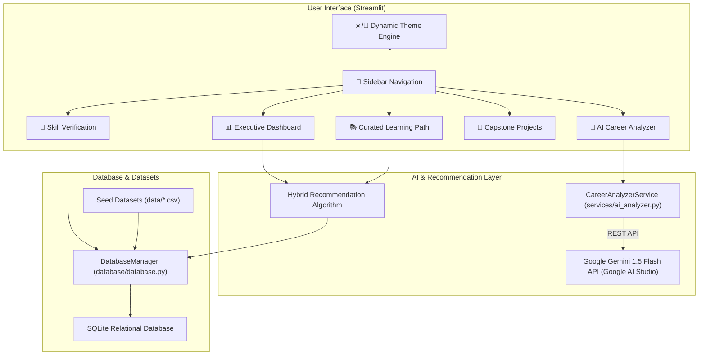
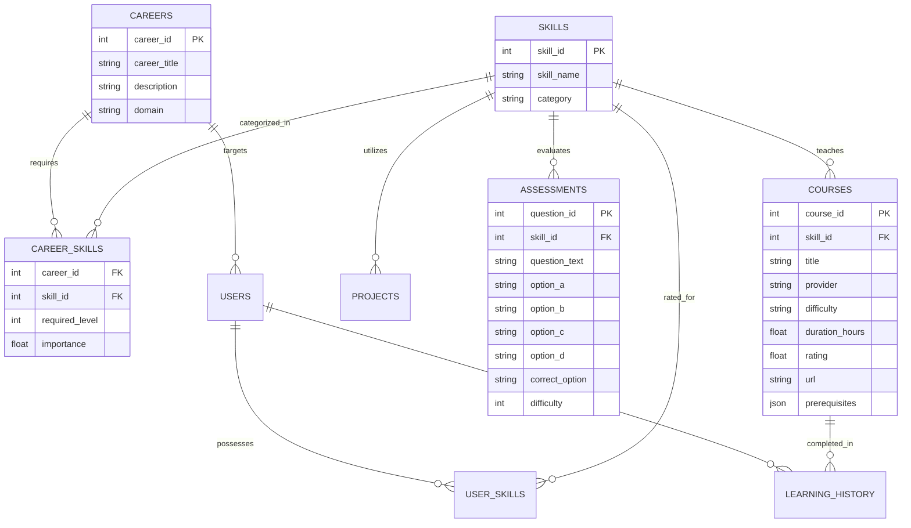

# 🎓 CareerPath AI — Smart Learning & Career Path Recommender System

<div align="center">

[](https://streamlit.io/)
[](https://www.python.org/)
[](https://aistudio.google.com/)
[](https://opensource.org/licenses/MIT)

**An enterprise-grade, AI-powered diagnostic engine and personalized learning path recommendation platform.**  
*Bridging the gap between current skillsets and industry-ready tech careers through Google Gemini LLM intelligence, adaptive assessments, and hybrid machine learning recommendations.*

[Key Features](#-key-features) • [Get Free Gemini API Key](#-how-to-get-your-free-google-gemini-api-key) • [System Architecture](#-system-architecture--data-flow) • [Quick Start](#-quick-start--local-development) • [Deployment Guide](#-deployment-guide) • [Database Schema](#-data-models--database-schema)

</div>

---

## 📖 Executive Summary

The modern technology job landscape is rapidly evolving, creating an overwhelming array of skills, frameworks, certifications, and learning resources. Self-learners, university graduates, and transitioning professionals frequently struggle with:
1. **Unclear Skill Baselines**: Not knowing exactly where their current abilities stand relative to industry benchmarks.
2. **Analysis Paralysis**: Getting lost in thousands of disconnected online tutorials without a structured progression.
3. **Imprecise Career Mapping**: Lacking visibility into the specific prerequisite chains and priority gaps required for specialized roles.

**CareerPath AI** solves this by providing a unified, data-driven platform that diagnoses user abilities, extracts structured learner profiles from natural language descriptions or resumes using **Google Gemini 1.5 Flash**, computes exact skill gap matrices, and generates an end-to-end curriculum roadmap featuring tailored courses, capstone projects, and interactive diagnostic quizzes.

---

## 🔑 How to Get Your Free Google Gemini API Key

CareerPath AI uses Google's latest **Gemini 1.5 Flash** model for natural language career profile extraction, personalized strategic advice, and dynamic quiz generation. Google provides a **100% free tier** for developers.

### Step 1: Open Google AI Studio
Visit the official Google AI Studio key management page:  
👉 **[https://aistudio.google.com/app/apikey](https://aistudio.google.com/app/apikey)**

### Step 2: Sign In & Create Your Key
1. Sign in with your standard **Google / Gmail account**.
2. Click the blue **"Create API key"** (or **"Get API key"**) button.
3. Select an existing Google Cloud project or click **"Create key in new project"**.
4. Copy the generated API key (it starts with `AIzaSy...`).

---

### Step 3: Use Your API Key in CareerPath AI

You can provide your key using any of the following 3 easy methods:

#### Method A: Direct Web Interface (Instant & Easiest)
1. Launch or open the CareerPath AI dashboard.
2. Navigate to the sidebar or the **🤖 AI Career Analyzer** tab.
3. Paste your key into the **"Gemini API Key"** input field.
4. The key is securely saved for your session and persisted across page reloads.

#### Method B: Local `.env` File
Create a `.env` file in the root of the project directory:
```env
GEMINI_API_KEY=AIzaSyYourGeneratedGeminiKeyHere
```

#### Method C: Streamlit Community Cloud Secrets
When deploying to Streamlit Cloud:
1. Go to your app's **Settings** -> **Secrets**.
2. Paste:
```toml
GEMINI_API_KEY = "AIzaSyYourGeneratedGeminiKeyHere"
```
3. Click **Save**.

---

## 🌟 Key Features

### 1. 🤖 Google Gemini AI Career Counselor
- **Natural Language Profile Extraction**: Type a freeform career goal, background summary, or paste resume bullet points.
- **Dynamic Model Discovery**: Automatically discovers and interfaces with available Gemini models (`gemini-1.5-flash`, `gemini-2.0-flash`, `gemini-pro`) with automatic REST fallback.
- **Automated Skill Rating**: Maps unstructured text into a normalized 0–5 proficiency scale across 15 core technical competencies.
- **Personalized Rationale**: Generates custom executive summaries, strategic curriculum advice, and course-by-course explanatory rationales.

### 2. 📊 Interactive Skill Gap Diagnostic Engine
- **5 Supported Career Tracks**:
  - 📈 **Data Analyst** (Excel, SQL, Python, Pandas, Power BI, Data Visualization, Statistics)
  - 🔬 **Data Scientist** (Python, Pandas, Statistics, Machine Learning, Deep Learning, SQL)
  - 🤖 **AI/ML Engineer** (Python, Machine Learning, Deep Learning, Git, Statistics)
  - 💻 **Web Developer** (HTML & CSS, JavaScript, React, Git, Python)
  - 🛡️ **Cybersecurity Analyst** (Network Security, Ethical Hacking, Python, Git)
- **Visual Radar / Spider Charts**: Real-time Plotly polar charts comparing target career requirement benchmarks against current user proficiency.
- **Priority Categorization**: Categorizes each competency into **High Priority** (gap ≥ 2), **Medium Priority** (gap = 1), or **Complete** (gap = 0).

### 3. 🎯 Hybrid Course & Project Recommendation Engine
- **Multi-Factor Scoring Formula**:
  $$\text{Score} = (0.30 \times \text{Gap}) + (0.25 \times \text{Relevance}) + (0.15 \times \text{Prerequisites}) + (0.10 \times \text{Difficulty}) + (0.10 \times \text{Interest}) + (0.10 \times \text{Rating})$$
- **Prerequisite Validation**: Prevents cognitive overload by ensuring foundational topics (e.g. basic Python) are recommended before advanced specializations (e.g. PyTorch Deep Learning).
- **Capstone Project Matching**: Recommends real-world portfolio projects (e.g. *E-Commerce Fraud Detection*, *Full-Stack React Dashboard*, *Network Vulnerability Scanner*).

### 4. 📝 225-Question Adaptive Assessment Bank
- **15 Standardized Skill Domains**: 15 multiple-choice diagnostic questions per skill (225 total curated items) covering Beginner, Intermediate, and Advanced tiers.
- **Automated Skill Recalibration**: Completing an assessment calculates accuracy and automatically syncs the updated proficiency level back to the learner's database profile.
- **AI-Powered Dynamic Quiz Generator**: Generate custom real-time quiz questions on-the-fly via Google Gemini for any skill.

### 5. 🌙 Dynamic Executive Theme System
- **☀️ Executive Light Theme**: Clean, high-contrast, professional corporate layout for presentations and daylight usage.
- **🌙 Modern Dark Glassmorphism Theme**: Cyberpunk-inspired dark aesthetic featuring translucent glass cards, neon accents, gradient borders, and responsive hover micro-interactions.

---

## 🏗️ System Architecture & Data Flow



---

## 📊 Data Models & Database Schema



---

## 📁 Repository Structure

```
hcl/
├── .streamlit/
│   └── config.toml             # Headless server, port, theme & CORS configuration
├── data/                       # Curated enterprise seed datasets
│   ├── careers.csv             # 5 supported tech career tracks
│   ├── skills.csv              # 15 technical skill competencies
│   ├── career_skills.csv       # Skill requirement & importance matrix
│   ├── courses.csv             # Catalog of vetted learning courses
│   ├── projects.csv            # Industry capstone projects
│   ├── assessments.csv         # 225-question diagnostic assessment bank
│   ├── learning_history.csv    # User progress & completion tracking
│   ├── generate_courses.py     # Course generator utility
│   └── generate_assessments.py # Question bank generator script
├── database/
│   ├── __init__.py
│   ├── database.py             # SQLite database manager & CRUD operations
│   └── schema.sql              # Relational database table definitions
├── services/
│   ├── __init__.py
│   └── ai_analyzer.py          # Gemini LLM analyzer, parser & fallback logic
├── tests/                      # Automated test suites
│   ├── test_ai_analyzer.py     # LLM parsing, quiz generation & prompt tests
│   ├── test_database.py        # CRUD, user profile & matrix tests
│   ├── test_datasets.py        # CSV dataset integrity & schema verification
│   └── test_env.py             # Dependency & environment verification
├── utils/
│   ├── __init__.py
│   ├── constants.py            # System constants, weights & sample prompts
│   ├── helpers.py              # Key persistence, formatting & helpers
│   └── validators.py           # Input sanitization and validators
├── app.py                      # Main application UI & dashboard controller
├── streamlit_app.py            # Streamlit Cloud deployment entrypoint
├── requirements.txt            # Python dependencies
└── README.md                   # Project master documentation
```

---

## 🚀 Quick Start & Local Development

### Prerequisites
- Python 3.10, 3.11, or 3.12
- Git
- Free [Google Gemini API Key](https://aistudio.google.com/app/apikey) *(Optional, for live LLM counseling)*

### 1. Clone the Repository
```bash
git clone https://github.com/GOKUL-V003/hcl_amplified.git
cd hcl_amplified
```

### 2. Create and Activate a Virtual Environment
```bash
# Windows (PowerShell):
python -m venv .venv
.\.venv\Scripts\Activate.ps1

# macOS / Linux:
python3 -m venv .venv
source .venv/bin/activate
```

### 3. Install Dependencies
```bash
pip install -r requirements.txt
```

### 4. Configure Environment Variables (Optional)
Create a `.env` file in the root directory:
```env
GEMINI_API_KEY=AIzaSyYourGeneratedGeminiKeyHere
```
*(You can also securely paste your key directly into the app UI at any time).*

### 5. Launch the Application
```bash
streamlit run app.py
```
Open your browser and navigate to: **[http://localhost:8501](http://localhost:8501)**

---

## 🧪 Testing & Quality Assurance

The project includes an automated **pytest** suite with 100% test pass coverage across AI services, database queries, dataset validation, and environment dependencies.

Execute the test suite:
```bash
pytest -v
```

Expected output:
```text
============================= test session starts =============================
tests/test_ai_analyzer.py::test_missing_api_key_raises_error PASSED      [  7%]
tests/test_ai_analyzer.py::test_gemini_api_analysis_success PASSED       [ 14%]
tests/test_ai_analyzer.py::test_empty_prompt_fallback PASSED             [ 21%]
tests/test_ai_analyzer.py::test_course_explanation_generation PASSED     [ 28%]
tests/test_ai_analyzer.py::test_curriculum_strategy_generation PASSED    [ 35%]
tests/test_ai_analyzer.py::test_profile_sync_to_database PASSED          [ 42%]
tests/test_ai_analyzer.py::test_generate_diagnostic_quiz PASSED          [ 50%]
tests/test_ai_analyzer.py::test_evaluate_diagnostic_quiz PASSED          [ 57%]
tests/test_database.py::test_schema_and_seeding PASSED                   [ 64%]
tests/test_database.py::test_user_profile_crud PASSED                    [ 71%]
tests/test_database.py::test_user_skills_matrix PASSED                   [ 78%]
tests/test_database.py::test_learning_history_recording PASSED           [ 85%]
tests/test_datasets.py::test_datasets_exist_and_valid PASSED             [ 92%]
tests/test_env.py::test_environment_imports PASSED                       [100%]

============================= 14 passed in 5.21s ==============================
```

---

## ☁️ Deployment Guide (Streamlit Community Cloud)

1. Push your repository to GitHub:
   ```bash
   git push origin main
   ```
2. Visit **[share.streamlit.io](https://share.streamlit.io)** and log in with your GitHub account.
3. Click **"New app"** (or **"Create app"**).
4. Configure deployment:
   - **Repository**: `YourUsername/hcl_amplified`
   - **Branch**: `main`
   - **Main file path**: `app.py` (or `streamlit_app.py`)
5. Under **Advanced settings** -> **Secrets**, add your Gemini key:
   ```toml
   GEMINI_API_KEY = "AIzaSyYourGeneratedGeminiKeyHere"
   ```
6. Click **Deploy!** Your app will be live worldwide in ~1-2 minutes.

---

## 🛠️ Technology Stack

| Layer | Technologies | Purpose |
|---|---|---|
| **Frontend UI** | Streamlit, Plotly Express & Graph Objects | Dynamic data visualization, radar charts, and interactive dashboards |
| **Design System** | Custom Glassmorphism CSS, Plus Jakarta Sans | Dual-theme engine (Executive Light & Modern Dark) |
| **AI / NLP** | Google Gemini 1.5 Flash REST API | Natural language parsing, skill extraction, quiz generation & rationales |
| **Data Science & ML** | Pandas, NumPy, Scikit-Learn, NetworkX | Data manipulation, prerequisite DAG modeling, hybrid scoring algorithms |
| **Database** | SQLite3 | Relational data persistence with automatic seeding and CRUD operations |
| **Testing** | Pytest, Requests | Automated unit, regression, and integration testing |
| **Hosting** | Streamlit Community Cloud, Docker | Production deployment and cloud hosting |

---

## 🤝 Contributing

Contributions are welcome! If you'd like to improve CareerPath AI:

1. Fork the repository.
2. Create a feature branch: `git checkout -b feature/AmazingFeature`.
3. Commit your changes: `git commit -m "Add AmazingFeature"`.
4. Push to the branch: `git push origin feature/AmazingFeature`.
5. Open a Pull Request.

---

## 📄 License

This project is licensed under the **MIT License** — see the [LICENSE](LICENSE) file for details.

---

<div align="center">

**Developed with ❤️ by the CareerPath AI Engineering Team**  
*Empowering learners worldwide to achieve their dream careers through data and AI.*

</div>
